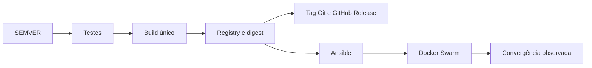

# Da versão ao servidor

Deploy não começa no servidor. Ele começa quando a entrega recebe um número
que acompanha o código, a imagem e o manifesto até o ambiente de destino.

O Specsfy usa um arquivo chamado `SEMVER` na raiz do projeto para manter essa
identidade. As skills de Docker, Docker Swarm, Ansible e engenharia de entrega
consultam o mesmo valor. Assim, você consegue responder qual código foi
compilado, qual imagem chegou ao registry e qual versão está ativa no cluster.

Este capítulo acompanha o percurso completo. A aplicação sai de uma mudança
validada, vira uma imagem imutável, passa pela preparação do servidor e chega
ao Docker Swarm com um caminho conhecido de rollback.

## O arquivo SEMVER

`SEMVER` contém uma única linha:

```text
1.4.0
```

O formato segue `MAJOR.MINOR.PATCH`:

- aumente `PATCH` para uma correção compatível, como `1.4.0` para `1.4.1`;
- aumente `MINOR` para uma capacidade nova e compatível, como `1.4.1` para
  `1.5.0`;
- aumente `MAJOR` quando a interface pública deixa de ser compatível, como
  `1.5.0` para `2.0.0`.

A skill `$specsfy-specialist-versioning` analisa o alcance da entrega, propõe o
incremento e explica a consequência. Durante a preparação autorizada, ela
atualiza o arquivo. Publicar imagem, criar tag, abrir uma GitHub Release ou
alterar um servidor continua dependendo de autorização explícita.

Se o projeto ainda não tiver o arquivo, informe a versão inicial:

```bash
node .agents/skills/specsfy-specialist-versioning/scripts/semver.mjs \
  init --initial 1.0.0 --project .
```

Consulte e incremente a versão com o mesmo utilitário:

```bash
node .agents/skills/specsfy-specialist-versioning/scripts/semver.mjs \
  current --project .

node .agents/skills/specsfy-specialist-versioning/scripts/semver.mjs \
  bump patch --project .
```

O caminho pode mudar conforme a biblioteca de skills do agente. O contrato
permanece o mesmo: `SEMVER` fica na raiz do projeto do usuário.

## Uma identidade, vários pontos de conferência

A versão preparada precisa aparecer nos artefatos que representam a entrega:

| Ponto | Exemplo para a versão `1.4.0` |
| --- | --- |
| Fonte local | `SEMVER` contém `1.4.0` |
| Changelog | seção da versão `1.4.0` |
| Imagem | `registry.example/app:1.4.0` |
| Anotação OCI | `org.opencontainers.image.version=1.4.0` |
| Manifesto | serviço aponta para `1.4.0` ou para seu digest |
| Git | tag `v1.4.0` |
| GitHub | release `v1.4.0` |

O commit também pode gerar uma tag de imagem, como `git-a1b2c3d`. Depois da
publicação, o digest `sha256:...` identifica o conteúdo exato promovido. O
número explica a evolução para pessoas; o digest garante que todos os nodes
baixem os mesmos bytes.



## Como as skills trabalham juntas

Você não precisa chamar cada especialista manualmente durante um fluxo de
deploy. O catálogo declara as relações necessárias.

### Versionamento prepara a entrega

`$specsfy-specialist-versioning` lê o estado atual, propõe `patch`, `minor` ou
`major` e atualiza `SEMVER`. Ela compara o valor com a publicação anterior e
recusa reutilizar um número já publicado.

### Docker produz a imagem

`$specsfy-specialist-docker` carrega a versão quando a imagem deixa de servir
apenas ao desenvolvimento local. O build recebe a tag SemVer, a tag do commit
e as anotações OCI. A mesma imagem serve HTTP, filas, scheduler ou outros
processos, com comandos próprios.

A imagem é compilada uma vez. Staging e produção recebem o mesmo digest; não
há um novo build por ambiente.

### Ansible prepara os hosts

`$specsfy-specialist-ansible` confere `SEMVER`, imagem e manifestos no
preflight. Depois, prepara o Debian, autentica no registry, instala os arquivos
versionados e valida a stack antes da escrita no cluster.

Use `--check --diff` primeiro. Limite os hosts com `--limit` e aplique lotes
com `serial` quando a alteração alcançar várias máquinas. Segredos ficam no
Ansible Vault ou em um cofre externo, nunca no repositório.

### Docker Swarm aplica a versão

`$specsfy-specialist-docker-swarm` recebe uma imagem já publicada. O arquivo de
stack aponta para a tag conferida ou, de preferência, para o digest. O Swarm
distribui as réplicas, respeita healthchecks e executa `update_config`.

O retorno de `docker stack deploy` apenas confirma que o comando foi aceito.
A entrega termina quando as réplicas convergem e os sinais da aplicação
permanecem saudáveis.

## Sequência de uma entrega

### 1. Prepare a versão

Revise a mudança concluída, escolha o incremento e atualize o changelog junto
com `SEMVER`. Confirme que a versão é superior à tag mais recente.

```bash
VERSION=$(tr -d '\n' < SEMVER)
git tag --list "v${VERSION}"
```

Esse comando consulta o Git. Ele não cria a tag.

### 2. Teste e compile uma vez

Rode a suíte do projeto antes do build. Passe a versão e o commit como
metadados da imagem:

```bash
VERSION=$(tr -d '\n' < SEMVER)
COMMIT=$(git rev-parse --short=12 HEAD)

docker build \
  --label "org.opencontainers.image.version=${VERSION}" \
  --label "org.opencontainers.image.revision=${COMMIT}" \
  --tag "registry.example/app:${VERSION}" \
  --tag "registry.example/app:git-${COMMIT}" \
  .
```

Antes do push, confirme que a tag SemVer ainda não existe no registry. Uma tag
publicada é imutável. Se for preciso corrigir o conteúdo, prepare um novo
`PATCH`.

### 3. Publique o artefato antes da tag Git

Com autorização explícita, envie a imagem e confira o digest retornado. Só
depois crie `v1.4.0` no Git e a GitHub Release correspondente.

Essa ordem evita uma release pública sem imagem disponível. Ela também mantém
um caminho simples para repetir o deploy sem recompilar.

### 4. Valide os hosts e a stack

O preflight do Ansible deve confirmar:

- acesso aos hosts e ao registry;
- versão do Docker Engine e papel de cada node;
- presença das redes externas necessárias;
- existência dos Docker Secrets esperados;
- versão do manifesto igual ao conteúdo de `SEMVER`;
- acesso ao digest publicado;
- sintaxe aceita por `docker stack config`.

Check mode prepara essa leitura sem implantar a stack. Depois da autorização,
o playbook copia os manifestos e chama o deploy na ordem das dependências.

### 5. Observe a convergência

Depois de `docker stack deploy`, acompanhe cada serviço:

```bash
docker stack services minha-stack
docker service ps minha-stack_web
docker service logs --since 10m minha-stack_web
```

Compare réplicas desejadas e ativas, healthchecks, taxa de erro, latência e
consumo de recursos. Defina um prazo máximo para a convergência. Se o serviço
não estabilizar, interrompa a promoção e use a versão anterior já publicada.

## Migrations durante o rollout

Em um rolling update, versões antiga e nova podem executar ao mesmo tempo. A
alteração do banco precisa aceitar essa convivência.

Use o percurso expand/contract:

1. adicione coluna, tabela ou índice sem remover o contrato antigo;
2. publique código que entende os dois formatos;
3. migre ou preencha os dados necessários;
4. confirme que nenhum processo antigo depende do formato anterior;
5. remova o contrato antigo em outra versão.

Execute a migration por uma única tarefa ou réplica. Os serviços HTTP e os
workers não devem disputar a mesma migration durante o rollout.

## Rollback faz parte da preparação

Antes do deploy, registre a versão anterior e seu digest. O rollback de código
volta a stack para essa imagem. O rollback de dados é outro procedimento:
algumas migrations não podem ser desfeitas sem perda.

Um plano mínimo informa:

- versão e digest anteriores;
- comando para restaurar a referência da stack;
- compatibilidade do banco com a versão anterior;
- sinais que interrompem o rollout;
- pessoa responsável por acompanhar a recuperação.

No Swarm, `rollback_config` define paralelismo, intervalo, ordem e resposta a
falhas. Teste esse percurso em um ambiente representativo antes da primeira
execução em produção.

## Exemplo completo

Considere uma aplicação na versão `1.3.2`. A entrega adiciona um endpoint sem
quebrar clientes existentes. A skill propõe `minor`, então `SEMVER` passa para
`1.4.0`.

O pipeline testa o commit, cria `app:1.4.0` e `app:git-a1b2c3d`, publica ambas
e registra o digest. A tag Git `v1.4.0` é criada depois dessa confirmação. O
Ansible valida os nodes e instala o manifesto. O Swarm promove o digest com
`start-first`, observa a convergência e mantém `1.3.2` disponível para
rollback.

Ao final, `SEMVER`, changelog, imagem, manifesto, tag Git e GitHub Release
contam a mesma história.

## Antes de considerar o deploy concluído

- `SEMVER` contém a versão preparada.
- A versão é superior à última publicação.
- Testes e build partiram do mesmo commit.
- A imagem SemVer e a imagem do commit apontam para o mesmo digest.
- O manifesto usa a imagem conferida.
- A tag Git foi criada depois da publicação da imagem.
- O preflight do Ansible passou no ambiente correto.
- A stack convergiu e os sinais permaneceram saudáveis.
- A versão anterior continua disponível para rollback.
- O resultado foi registrado na especificação e no changelog.

Para conhecer cada especialista, continue em [Skills
especialistas](specialists.md). Para pipelines e automações adicionais,
consulte [Uso avançado](advanced-usage.md).

## Justificativa de tamanho

Este capítulo mantém no mesmo percurso a versão, o artefato, a preparação dos
hosts e a operação do cluster. A leitura conjunta permite conferir a passagem
do `SEMVER` ao runtime sem separar etapas que dependem umas das outras.
